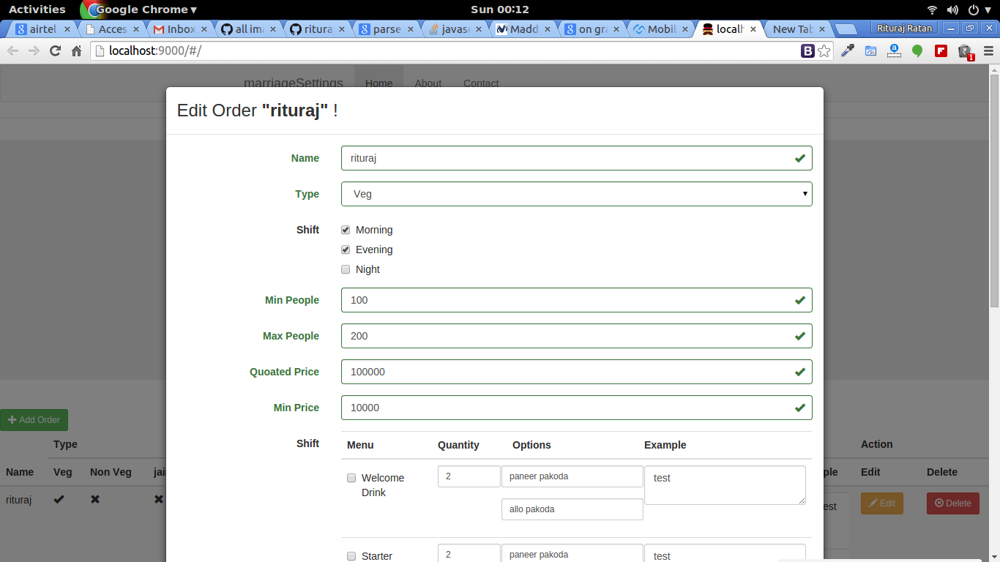

=======
A CRUD operation related to marriage related Settings .

# marriage-settings

This project is generated with [yo angular generator](https://github.com/yeoman/generator-angular)
version 0.11.1.

## Build & development

Run `grunt` for building and `grunt serve` for preview.

## Testing

Running `grunt test` will run the unit tests with karma.

======
Some screen Shot

###Listing Page

###Add Page

###Edit Page

###Delete Page

